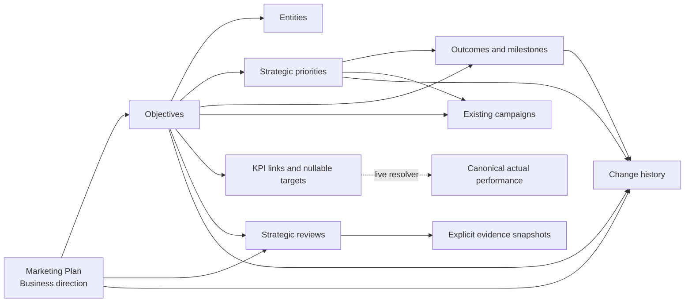

# Marketing Plan architecture review

**Repository:** AI Office v2
**Branch audited:** `dashboard-v2`
**Purpose:** architecture proposal only. No schema, production data or production configuration changes are included.

## Recommendation

Build Marketing Plan as a separate, additive domain that links to existing Campaign, entity and canonical KPI sources. Do not extend Campaign records to hold strategy. Do not reuse either of the two existing objective implementations as the new model.

The first release should provide a plan root, objectives, priorities, milestones, campaign links, KPI targets, reviews and lightweight history. Actual KPI values must be resolved at read time through an allowlisted KPI registry that calls the existing canonical reporting logic. Missing values remain unavailable, not zero.

This proposal does not materially redefine an existing campaign, KPI or attribution model. It does introduce new persistent tables, so implementation should start only after this architecture is accepted.

## 1. Existing structures that can be reused

### Campaigns

The existing `campaigns` table remains the source of truth for campaigns. It already supports:

- canonical multi-entity membership through `entities`, with `brand` as the legacy fallback
- campaign status and dates
- schedule milestones
- manual campaign results
- explicit Google Ads and GA4 attribution identifiers
- structured campaign costs through the separate `campaign_costs` table
- archival fields

Marketing Plan should link to campaign IDs. It must not copy campaign names, spend, results, attribution identifiers or schedules into strategy tables.

### Entities

The existing `Brand` values and `EntityContext` remain authoritative:

- MTech Group
- Brentwood
- Radio Links
- Capcom
- Irish Radio
- IDARO
- Brentwood Marine

Objectives need many-to-many entity membership because an objective can support several entities. The existing canonical campaign membership rule remains unchanged.

### KPI and performance logic

`KPI_DEFINITIONS.md`, `DATA_INTEGRITY.md` and the existing source-specific utilities remain authoritative. Reusable sources include:

- GA4 website users, sessions and verified GA4 Enquiries
- Google Ads spend, clicks, impressions and Google Ads conversions
- Infinity call reporting with existing entity mapping and phone masking
- Campaign Monitor reporting with its existing mapping rules
- Acumatica opportunity, open pipeline, Won Deals and Won Revenue reporting
- Known Campaign Spend and structured campaign costs
- manually logged Marketing Leads and campaign Enquiries, clearly labelled as manual

Strategy must never store a second live copy of these actuals. It should store only the selected KPI key and nullable target. A resolver returns the current canonical actual, availability, source label and supported trend.

### Calendar

The existing Calendar combines campaign schedules, email sends, funding dates and task-derived events. Marketing Plan milestones can be added as another read-only event source. Existing campaign and email events should not be rebuilt.

### Audit and permissions

The current application has:

- session-protected reads
- separate `edit` and `view` roles
- `requireEdit` on mutations
- an `audit_log` containing before and after values
- archival patterns on several entities

Marketing Plan APIs should use the same authentication and edit boundary. The existing global audit feed can remain unchanged; strategy also needs a narrower history table because the brief requires an optional reason and an objective-focused chronological view.

### Microsoft To Do

The repository already contains delegated Microsoft Graph token storage and an OAuth/list-discovery route. This phase should not extend that integration. The visible **My Tasks** navigation should become a clearly marked external Microsoft To Do link.

The existing `tasks` table cannot be removed: it also stores Campaign Monitor email sends and supports campaign schedules and existing calendar activity. Personal task management can leave the user interface while these internal records continue to support existing features.

## 2. Existing structures that should not be reused as the new model

There are two overlapping, unfinished objective systems:

1. `business_objectives`, used by `marketingOsRepository`, generic MCP access and the old dashboard-generation service.
2. `marketing_objectives`, created by `marketingRepository`, with separate context and strategy snapshot tables.

They use incompatible fields and statuses. The frontend `useMarketingOSStore` also expects a different contract from the mounted `/api/marketingos` routes. Neither model supports the required hierarchy, multi-entity membership, ordered priorities, derived weekly focus, canonical KPI targets or structured reviews.

Do not silently migrate or merge these records. Before implementation, run a read-only inventory in each target environment. If genuine records exist, present them for manual mapping into the new model. Keep the legacy tables untouched until that mapping is explicitly approved.

## 3. Proposed new persistent model

All new tables use text IDs, ISO timestamps, soft archival and API validation. Internal Marketing Plan relationships use foreign keys. Campaign IDs are validated by the service layer rather than adding a database foreign key that could change the existing campaign deletion behaviour.

### `marketing_plans`

One strategic plan for a defined period.

| Field | Purpose |
|---|---|
| `id` | Stable ID |
| `title` | User-entered plan title |
| `period_year` | Relevant year |
| `business_direction` | Long-form business direction |
| `status` | Draft, Proposed, Approved, Complete or Needs confirmation |
| `next_review_date` | Nullable strategic review date |
| `notes` | Optional commentary |
| timestamps and archive fields | Lifecycle and soft deletion |

No business target or marketing budget is required. Unknown values remain absent or TBC in their relevant target records.

### `marketing_plan_objectives`

| Field | Purpose |
|---|---|
| `plan_id` | Parent plan |
| `title`, `description` | Objective definition |
| `status` | Draft, Proposed, Approved, Complete, TBC or Needs confirmation |
| `priority` | High, Medium, Low or TBC |
| `period_year`, `quarter` | Nullable timeframe |
| `why_it_matters` | Strategic rationale |
| `customer_market_context` | Customer and market context |
| `commercial_relevance` | Commercial relevance without invented attribution |
| `marketing_rationale` | Marketing rationale |
| `next_review_date` | Nullable review date |
| `sort_order` | Explicit user-controlled order |
| `notes` | Optional commentary |
| timestamps and archive fields | Lifecycle and soft deletion |

### `marketing_plan_objective_entities`

Join table containing `objective_id` and canonical `brand`. This supports one or several entities without overloading the legacy campaign `brand` field.

### `marketing_plan_priorities`

Ordered strategic priorities belonging to an objective. Fields: `objective_id`, title, description, status, `sort_order`, notes, timestamps and archive fields.

### `marketing_plan_milestones`

One model for meaningful delivery outcomes at different planning levels.

| Field | Purpose |
|---|---|
| `objective_id` | Required parent objective |
| `priority_id` | Optional supporting priority |
| `level` | Quarterly outcome, Monthly milestone or Current focus |
| `title`, `description` | Meaningful marketing outcome or milestone |
| `status` | Draft, Proposed, Approved, In progress, Complete, TBC or Needs confirmation |
| `period_year`, `quarter`, `month` | Nullable structured period |
| `start_date`, `due_date` | Nullable dates for derived views |
| `attention_type` | Optional decision, review, approval or missing-information flag |
| `sort_order`, notes, timestamps, archive fields | Editing and lifecycle |

The **This Week** view is derived from milestone dates, attention flags and objective review dates. It is not a second task list.

### `marketing_plan_campaign_links`

Links an existing campaign to an objective and optionally a priority. Fields: `objective_id`, nullable `priority_id`, `campaign_id`, `sort_order` and `created_at`. A unique constraint prevents duplicate links.

Campaign records remain unchanged. A missing or archived campaign is shown as unavailable rather than recreated from copied text.

### `marketing_plan_kpis`

Associates an objective with an allowlisted canonical KPI.

| Field | Purpose |
|---|---|
| `objective_id` | Parent objective |
| `kpi_key` | Stable key from the code-owned KPI registry |
| `target_value` | Nullable numeric target |
| `target_unit` | Count, GBP, percent or another registry-approved unit |
| `target_direction` | Increase, decrease, maintain or reach |
| `target_status` | TBC, Proposed or Approved |
| `period_scope` | Objective period, quarter, month or all time where supported |
| `sort_order`, notes, timestamps | Editing and presentation |

Actuals, availability and trends are not columns. They are resolved live. A genuine target of zero is stored as numeric zero; an unknown target is `NULL` with `target_status = 'TBC'`.

### `marketing_plan_reviews`

Stores user-authored strategic reviews. It can belong to the whole plan or one objective.

Fields include review type, period/year/quarter/month, status, review date, and the following long-form sections:

- what happened
- what changed
- why it matters
- what worked
- what did not work
- what we learned
- what changes next

All interpretive fields remain user editable. The application may display evidence beside them but must not write strategic conclusions automatically.

### `marketing_plan_review_evidence`

Optional evidence snapshot created only when the user explicitly saves or completes a review. It records the linked KPI key, target at that time, formatted actual, numeric actual where available, availability status, trend where supported, source label, measured period and capture time.

This preserves what was known during a review without changing the live KPI source of truth. Unavailable evidence is stored as unavailable, never zero.

### `marketing_plan_history`

Lightweight chronological history for plan resources:

- resource type and ID
- action and changed field
- previous and new JSON values
- optional reason
- source (`dashboard` initially)
- timestamp

Create, edit, reorder, link, unlink, archive, restore and status changes should write history. Read-only KPI refreshes should not.

## 4. Relationship map

## 5. Canonical KPI registry

Create a code-owned `strategyKpiRegistry`, not a database table of formulas. Each entry should define:

- stable key and label
- unit and formatting
- supported entity coverage
- supported period scopes
- canonical resolver
- availability wording
- whether previous-period trend is supported
- destination screen for drill-down

Initial keys should be selected from existing defined KPIs only. Do not add a generic formula builder in this phase.

Some existing helpers support only a single selected entity or the standard group aggregate. A strategy objective can cover an arbitrary entity subset. Initial implementation must either:

1. use an already supported single/group scope, or
2. add a reconciled subset wrapper around the same canonical primitives.

Any subset resolver must be tested to equal existing single-entity and group outputs before it is used. This is an implementation extension, not permission to change a KPI definition.

Important preserved semantics include:

- Open Pipeline is Status Open plus Status New
- Stage does not determine commercial status
- Won Revenue has no trustworthy Won Date and keeps its documented Created On/current Status semantics
- IRCL remains outside Acumatica
- Sales-reported Source is not deterministic attribution
- Source Lead remains excluded
- Google Ads conversions and GA4 Enquiries remain separate
- unavailable data never becomes zero

## 6. Derived views

### Strategy Map

Primary visual view: business direction → objectives → priorities → linked campaigns and KPIs. Use accessible HTML controls and progressive disclosure. Selecting a campaign or KPI navigates to the existing relevant screen.

### Quarter

Query objectives, priorities, quarterly outcomes, linked campaigns and KPIs for the selected quarter. Progress is derived from milestone status and available KPI evidence; do not invent a percentage when no defined denominator exists.

### Month

Query monthly milestones and linked campaign milestones. It remains an outcome view, not a personal task list.

### This Week

Derive from:

- incomplete milestones due or starting this week
- overdue incomplete milestones
- decisions, reviews, approvals and missing-information flags
- overdue objective or plan review dates

No duplicate weekly records are created.

### Progress

Join objective KPI links to live registry results. Show target as TBC when absent and actual as Unavailable or Not connected where appropriate. Trend appears only when the canonical source supports a valid comparison.

### Strategy Health

Compute factual gaps on read. Do not persist or score them. Rules:

- objective has no KPI
- KPI target is absent/TBC
- rationale fields are empty
- priority has no linked campaign or milestone
- milestone is overdue
- review is overdue
- KPI source is unavailable
- objective timeframe is missing

Each finding links to the affected objective. No arbitrary score or percentage is produced.

### Reviews

List and edit strategic reviews, with canonical evidence shown alongside user-authored interpretation.

## 7. API and backend changes

Add a session-protected `/api/marketing-plan` router with read routes for all signed-in users and `requireEdit` on every mutation.

Suggested route groups:

- plans and plan summary
- objectives and entity membership
- priorities and reorder operations
- milestones and period queries
- campaign link/unlink
- KPI link/target update and live progress resolution
- health findings
- reviews and explicit evidence capture
- history

Use Zod validation, database transactions for multi-row edits/reorders and soft archive by default. A destructive permanent-delete route is unnecessary in the first release.

Do not expose the new tables through generic MCP automatically. A future assistant should receive a narrow, read-only Marketing Plan query service with allowlisted fields. Any write tools require a separate design and confirmation policy.

## 8. Frontend components and routes

Add `marketing-plan` as a primary navigation item. Within it, use tabs or subnavigation for:

- Strategy Map
- Quarter
- Month
- This Week
- Progress
- Reviews

Add a dedicated objective workspace route/state with editable sections for objective details, rationale, priorities, milestones, campaign links, KPI targets, next review and history.

Recommended component boundaries:

- `MarketingPlanScreen`
- `StrategyMap`
- `QuarterPlanView`
- `MonthPlanView`
- `WeeklyFocusView`
- `StrategyProgressView`
- `StrategyReviewsView`
- `ObjectiveWorkspace`
- `StrategyHealthPanel`
- focused editors/link pickers for priorities, milestones, campaigns and KPIs

The empty state should say that no marketing objectives have been added and invite an editor to create the first one. It must not seed examples.

## 9. Home and Microsoft To Do changes

After genuine Marketing Plan records exist, replace the Home task-based priority area with **Marketing Focus**:

- This Quarter
- This Week
- Needs Attention

All counts and items derive from the plan and health queries. With no records, show an explanatory empty state rather than zero-like performance or demo content.

Change the sidebar's My Tasks item to an external Microsoft To Do link. Extend the navigation component with an explicit external URL and external-link treatment. Do not build task synchronisation in this phase.

Keep the internal task data and APIs because Campaign Monitor sends, campaign activity and the existing Calendar still depend on them. Remove personal-task entry points only after checking every remaining task consumer.

## 10. Migration implications

Use an additive, numbered migration executed in a transaction:

1. create the new Marketing Plan tables and indexes
2. create no default rows
3. do not alter or delete campaigns, tasks, KPI data or either legacy objective model
4. inventory legacy objective records read-only
5. present any genuine legacy records for explicit manual mapping

The current schema is largely created at application boot. For this multi-table feature, a small `schema_migrations` ledger is safer than a long series of untracked boot-time alterations. Introducing it for new migrations does not require rewriting existing schema creation.

No production migration should run until it has passed against a copied/local database and a preview database. The migration must be reversible by dropping only empty new tables before production use; after real Marketing Plan records exist, rollback should preserve/export them rather than discard them.

## 11. Risks and controls

| Risk | Control |
|---|---|
| Two legacy objective systems are mistaken for one source | Treat both as legacy; inventory and map explicitly |
| Strategy actuals drift from dashboard figures | Code-owned registry calling canonical resolvers; reconciliation tests |
| Arbitrary entity subsets change KPI meaning | Enable only supported/reconciled scopes |
| Marketing Plan becomes a task manager | Milestones are strategic outcomes; weekly view is derived; Microsoft To Do remains external |
| Campaign data is duplicated | Store links only |
| Campaign deletion leaves a broken strategy link | Validate links and show an unavailable/archived state; do not change current campaign deletion semantics silently |
| Missing targets become zero | Nullable value plus explicit target status |
| Live missing data becomes zero | Resolver carries availability separately from numeric value |
| Reviews contain invented conclusions | Evidence is surfaced; interpretation remains user-authored |
| History becomes excessive or sensitive | Record only strategy mutations and optional reason; preserve current access controls |
| New MCP exposure broadens access | No automatic generic MCP registration |
| Preview sample data appears as real strategy | No Marketing Plan seed data; exclude existing preview-only records from management reporting before an MD demonstration |

## 12. Deliberately outside AI Office in this phase

- personal day-to-day task management
- Microsoft To Do synchronisation
- the future Ask AI Office assistant
- OpenAI API integration
- live spreadsheet backup/synchronisation
- invented business targets, sales targets or budgets
- subjective strategy scoring
- CRM/customer personal data
- automatic strategic conclusions
- changes to attribution, KPI definitions or commercial classification

## 13. Proposed implementation sequence

1. **Foundation:** numbered additive migration, types, repository, validation and permission tests.
2. **Objective workspace:** plan/objective/priority/milestone editing, entity membership and history.
3. **Relationships:** campaign linking and allowlisted KPI target linking.
4. **Strategy views:** Strategy Map, Quarter, Month and derived This Week.
5. **Progress and health:** canonical KPI resolver, factual gaps and reconciliation tests.
6. **Reviews:** editable reviews and explicit evidence snapshots.
7. **Home/navigation:** Marketing Focus and external Microsoft To Do link after plan data exists.
8. **Hardening:** accessibility, tablet layout, empty states, preview verification and export-friendly read models.

Each step should be a separately reviewable commit with frontend/backend builds, focused tests, manual preview checks and no production writes.

## Decision requested before implementation

Approve or amend these architectural decisions:

1. Use a new additive Marketing Plan domain rather than either legacy objective model.
2. Keep existing campaign, task and KPI records unchanged and link to them.
3. Use one milestone table for quarterly outcomes, monthly milestones and current focus.
4. Resolve actual performance live through an allowlisted canonical KPI registry.
5. Capture KPI evidence only when a user explicitly saves/completes a review.
6. Keep new Marketing Plan data out of generic MCP access during this phase.
7. Replace the visible My Tasks navigation with an external Microsoft To Do link while retaining internal task records required by other features.
